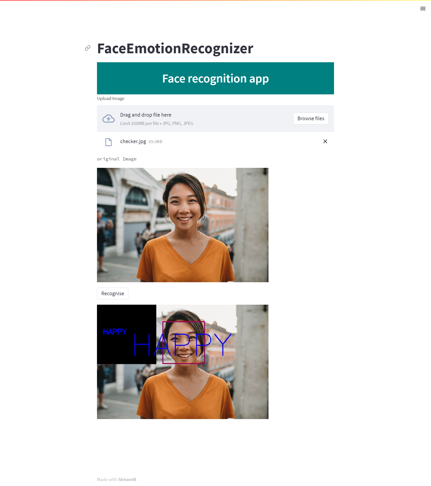

# Face-Emotion-Recognizer
This Project using FER(Facial Expression Recognition) dataset for training purposes.Used Transfer learning methodology and Tensorflow and OpenCV library for training and building the model.
Project is deployed using streamlit.

